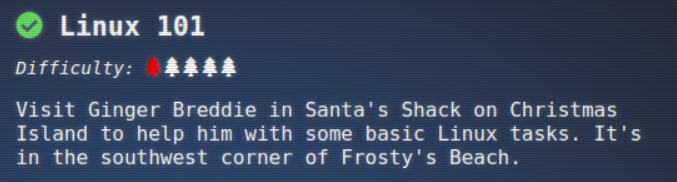

## Objective "Linux 101"

### Location 

Christmas Istland: Santa's Surf Shack

### Task and Solution

This is a fun way about learning the basics of linux and CLI

- ls
- cat troll_19315479765589239
- rm troll_19315479765589239
- pwd 
- ls -la 
- history | grep troll
- env | grep -i troll
- cd workshop; grep -i troll toolbox_*
- chmod +x present_engine && ./present_engine
- cd /home/elf/workshop/electrical/ && mv blown_fuse0 fuse0
- ln -s fuse0 fuse1
- cp fuse1 fuse2
- echo TROLL_REPELLENT >> fuse2
- cd /opt/troll_den && find . -user troll
- find . -type f -size +100k -size -110k
- ps -ef | grep _troll | grep -v grep
- netstat -napt
- curl http://localhost:54321
- ps -elf | grep troll ; kill -9 PID_of_python3

