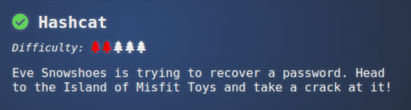

## Objective "Hashcat"

### Location 

Island of Misfit Toys: Scaredy Kite Heights

### Task and Solution

This task is about using the hashcat tool for password recovery.

hashcat -w 1 -u 1 --kernel-accel 1 --kernel-loops 1 -a 0 -m 18200 hash.txt password_list.txt --force -O --show

$krb5asrep$23$alabaster_snowball@XMAS.LOCAL:22865a2bceeaa73227ea4021879eda02$8f07417379e610e2dc
b0621462fec3675bb5a850aba31837d541e50c622dc5faee60e48e019256e466d29b4d8c43cbf5bf7264b12c2173749
9cfcb73d95a903005a6ab6d9689ddd2772b908fc0d0aef43bb34db66af1dddb55b64937d3c7d7e93a91a7f303fef96e
17d7f5479bae25c0183e74822ac652e92a56d0251bb5d975c2f2b63f4458526824f2c3dc1f1fcbacb2f6e52022ba6e6
b401660b43b5070409cac0cc6223a2bf1b4b415574d7132f2607e12075f7cd2f8674c33e40d8ed55628f1c3eb08dbb8
845b0f3bae708784c805b9a3f4b78ddf6830ad0e9eafb07980d7f2e270d8dd1966:IluvC4ndyC4nes!

elf@1f4f4b9ff167:~$ /bin/runtoanswer 
What is the password for the hash in /home/elf/hash.txt ?

> IluvC4ndyC4nes!
Your answer: IluvC4ndyC4nes!

Checking....
Your answer is correct!